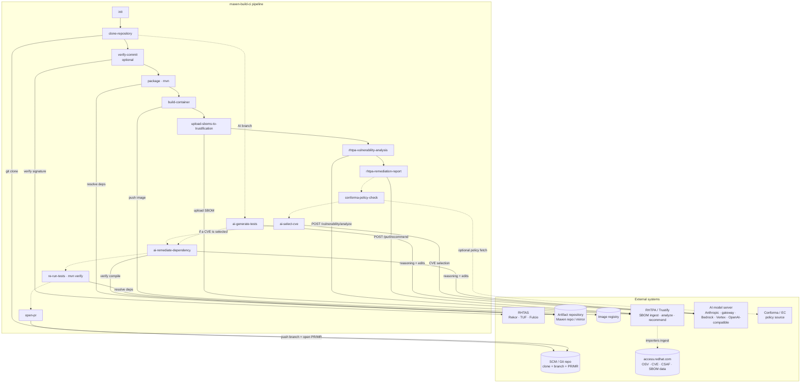

# AI vulnerability remediation branch for `maven-build-ci`

This extends the existing `maven-build-ci` pipeline with an **opt-in** AI branch
that, on top of the normal build → SBOM → RHTPA scan flow:

1. Generates and runs unit tests for the app (AI coding agent).
2. Turns the RHTPA **vulnerability-analysis** report into a policy **must-fix**
   set (Conforma/Enterprise Contract gate, with a severity-based fallback). The
   analyze report is the source of truth (CVE + severity + affected PURL); the
   recommend report is supplemental (it is a Red Hat-rebuild catalog lookup and is
   usually empty for upstream-only Maven deps).
3. Asks the AI to select **exactly one** CVE to remediate, constrained to the
   must-fix set and steered by a user-defined policy.
4. Has the AI update the vulnerable Maven dependency to its fixed version.
5. Re-runs all tests (existing + generated) with `mvn verify`.
6. Opens a **PR/MR** back to the app repo with the tests + remediation.

The whole branch is gated behind `enable-ai-remediation` (default `"false"`), so
the pipeline behaves exactly as before until you turn it on.

## Overview

The diagram shows each pipeline task (top-to-bottom in DAG order) and the
**external systems** it talks to. Solid task-to-task arrows are the always-on
build/scan chain; dotted arrows are the opt-in AI remediation branch. Solid edges
to external systems are the interactions each task makes.



Notes:

- **Base chain** (`init` → … → `rhtpa-remediation-report`) runs on every
  PipelineRun. **`verify-commit`** only runs with `verify-commit="true"` (needs
  RHTAS). The **AI branch** (dotted) only runs with `enable-ai-remediation="true"`,
  and `ai-remediate-dependency`/`re-run-tests`/`open-pr` additionally require
  `ai-select-cve` to actually pick a CVE.
- `ai-generate-tests` forks off `clone-repository` and runs in parallel with the
  build/scan chain; it rejoins at `ai-remediate-dependency`.
- **RHTPA** must already contain vulnerability data — it populates itself from
  `access.redhat.com` via its importers (dotted edge), independent of this
  pipeline. See [RHTPA importers](#rhtpa-importers-populate-the-vulnerability-data).
- The **AI model server** is whatever `ai-agent-config` points at (first-party
  Anthropic, a gateway/proxy, Bedrock, Vertex, or any OpenAI-compatible endpoint
  serving gpt-oss / Granite / etc.).

## Files

| File | Purpose |
|------|---------|
| `pipelines/maven-build-ci-pipeline-ai.yaml` | Pipeline with the gated AI branch wired into the existing DAG |
| `config/ai-agent-config.yaml` | ConfigMap — the single AI backend switch (provider/model/region/effort) |
| `config/rhtpa-enable-importers-job.yaml` | Job — idempotently enables + forces the RHTPA Red Hat SBOM/CSAF importers |
| `secrets/ai-agent-secret.example.yaml` | Example Secret — AI provider credentials |
| `secrets/scm-auth-secret.example.yaml` | Example Secret — Git token for opening the PR/MR |
| `tasks/ai-generate-tests.yaml` | AI generates + runs unit tests |
| `tasks/conforma-policy-check.yaml` | Conforma gate → must-fix CVE set |
| `tasks/ai-select-cve.yaml` | AI selects one CVE (structured output) |
| `tasks/ai-remediate-dependency.yaml` | AI bumps the dependency + verifies compile |
| `tasks/open-pr.yaml` | Commits to a branch and opens the PR/MR |
| `images/ai-agent-maven/Dockerfile` | Agent runtime (JDK17 + Maven + Claude Code + aider + git/glab/gh) |
| `images/ai-python/Dockerfile` | CVE-selector runtime (Anthropic + OpenAI Python SDKs) |

## DAG

```
init → clone-repository ─┬─ verify-commit → package → build-container → upload-sboms → rhtpa-vuln-analysis → rhtpa-remediation-report
                         │                                                                                          │
                         │                                                                          conforma-policy-check
                         │                                                                                          │
                         └─ ai-generate-tests ───────────────┐                                              ai-select-cve
                                                             │                                                     │
                                          ai-remediate-dependency  ←──────────────────────────────────────────────┘
                                                             │      (only if ai-select-cve.SELECTED == "1")
                                                       re-run-tests (mvn verify)
                                                             │
                                                          open-pr
```

`ai-generate-tests` runs in parallel with the build/scan chain (both fork off
`clone-repository`). `ai-remediate-dependency`, `re-run-tests`, and `open-pr` are
additionally gated on `ai-select-cve` actually picking a CVE, so a clean scan
(nothing must-fix) skips remediation and the PR but still contributes the
generated tests to the workspace. Because Tekton's "skipped-parent still runs the
successor" semantics don't apply when the successor's own `when` fails, the tail
of the branch is short-circuited cleanly when there's nothing to fix.

## Prerequisites

Everything below is assumed to be in place **before** the `## One-time setup`
commands. Items marked _(base pipeline)_ are required even with the AI branch off;
the rest are only needed when `enable-ai-remediation="true"`. The examples use the
namespace `tssc-app-ci` — substitute your own.

### Platform

| Requirement | Notes |
|-------------|-------|
| OpenShift 4.x _(base pipeline)_ | Target cluster. |
| **OpenShift Pipelines** (Tekton) operator _(base pipeline)_ | Provides `Task`/`Pipeline`/`PipelineRun` CRDs and the referenced cluster tasks (`init`, `git-clone`, `maven`, `build-container`/buildah, `verify-commit`). |
| **RHTPA 2.2.6** (Red Hat Trusted Profile Analyzer / Trustify) _(base pipeline)_ | Reachable from the cluster, with its OIDC issuer. Its vulnerability data must be **populated** — see [RHTPA importers](#rhtpa-importers-populate-the-vulnerability-data). |
| **Trusted Artifact Signer** (TAS) — _optional_ | Only if you run with `verify-commit="true"`. Supplies Rekor/TUF/Fulcio; drives the `oidc-issuer`, `rekor-url`, `tuf-mirror`, `certificate-identity` params. Left `"false"` by default. |
| Egress | RHTPA importers reach `access.redhat.com` (Red Hat SBOM/CSAF/OSV data); the AI provider endpoint (`api.anthropic.com:443` by default, or your gateway/Bedrock/Vertex/OpenAI-compatible host); the SCM host (`gitlab.com`/`github.com` or your on-prem SCM); and the image registry. Image **builds** additionally pull from `archive.apache.org`, `rpm.nodesource.com`, `gitlab.com`, `github.com`. |

### Secrets & ConfigMaps (in the pipeline namespace)

| Object | Kind | Required when | Keys / contents |
|--------|------|---------------|-----------------|
| `tpa-secret` | Secret | _(base pipeline)_ | `bombastic_api_url`, `oidc_issuer_url`, `oidc_client_id`, `oidc_client_secret`. Consumed by the RHTPA tasks **and** the importer Job. (Name overridable via `trustification-secret-name`.) |
| `ai-agent-config` | ConfigMap | AI branch | The single backend switch. Apply `config/ai-agent-config.yaml`; pick `AI_PROVIDER`/`AI_AGENT`/`AI_MODEL` (+ `AI_BASE_URL` for gateway/openai). |
| `ai-agent-secret` | Secret | AI branch | Provider credential(s) for the chosen `AI_PROVIDER` (e.g. `ANTHROPIC_API_KEY`). From `secrets/ai-agent-secret.example.yaml`. |
| `scm-auth-secret` | Secret | AI branch (PR step) | `username` + `token` with push + PR/MR-create scope. From `secrets/scm-auth-secret.example.yaml`. (Name overridable via `scm-secret-name`.) |

### Workspaces / PVCs

The `PipelineRun` must bind these workspaces (declared on the pipeline):

| Workspace | Backing | Purpose |
|-----------|---------|---------|
| `workspace` | PVC (RWO/RWX) | Source, SBOMs, and the RHTPA reports the AI branch reads. |
| `maven-settings` | ConfigMap/Secret with `settings.xml` | Maven repo/mirror config for `package` + `re-run-tests`. |
| `git-auth` | basic-auth Secret | Clone credentials for `git-clone`. |
| `gitops-auth` | Secret | As required by your base pipeline. |

### Container images (AI branch)

Build and push the two runtime images and set `agent-image` / `ai-python-image`
(they default to `quay.io/REPLACE_ME/...:v1.0.0`). Commands are in
[One-time setup](#one-time-setup) below.

### RHTPA importers (populate the vulnerability data)

RHTPA ships with an importer set seeded at install, but the two heavyweight Red
Hat importers are **disabled by default** because their first ingest is large and
slow. Until they run, `/purl/recommend` returns nothing (the recommend catalog is
empty), which is why the pipeline treats the **analyze** report as authoritative
and the **recommend** report as supplemental.

| Importer | Default | Provides | Needed for |
|----------|---------|----------|------------|
| `osv-github` | **enabled** | Upstream OSV/GHSA advisories | `analyze` findings (CVE + severity) |
| `cve` | **enabled** | NVD CVE records | `analyze` findings |
| `redhat-csaf` | **disabled** | Red Hat CSAF/VEX (fix status for Red Hat products) | Richer advisory/fix context |
| `redhat-sboms` | **disabled** | Red Hat SBOM rebuild catalog | Populating `/purl/recommend` (the supplemental signal) |
| `quay-redhat-user-workloads` | disabled | — | Not used by this pipeline |

**Enabling is a runtime setting in Trustify's database managed via the
`/api/v2/importer` REST API — RHTPA 2.2.6 does not expose it as an operator CR
field.** So the closest thing to "declarative" is an **idempotent Job** that
applies the API calls; commit it and apply it with the rest of your manifests (or
run it as an Argo CD sync hook / one-off `oc apply`):

```
oc -n tssc-app-ci apply -f config/rhtpa-enable-importers-job.yaml
oc -n tssc-app-ci logs -f job/rhtpa-enable-importers
```

The Job (`config/rhtpa-enable-importers-job.yaml`) reads `tpa-secret`, flips each
importer's nested `disabled` flag to `false`, and forces an immediate run. It is
safe to re-run (re-apply after `oc delete job rhtpa-enable-importers`); set the
`IMPORTERS` env in the manifest to change which importers it targets.

<details>
<summary>Equivalent manual API calls (for debugging)</summary>

```bash
# token helper (client-credentials; tokens are short-lived, re-mint per call)
auth() {
  ep=$(curl -sf "${OIDC_ISSUER_URL%/}/.well-known/openid-configuration" | jq -r .token_endpoint)
  echo "Authorization: Bearer $(curl -sf --user "$OIDC_CLIENT_ID:$OIDC_CLIENT_SECRET" \
        -d grant_type=client_credentials "$ep" | jq -r .access_token)"
}

# 1. list importers + their REAL state (disabled lives under the type key)
curl -sf -H "$(auth)" "$RHTPA_URL/api/v2/importer" \
  | jq -r '.[] | "\(.name)\tdisabled=\(.configuration|to_entries[0].value.disabled)\tlastRun=\(.lastRun)\tlastError=\(.lastError)"'

# 2. enable (flip the NESTED disabled, then PUT the whole configuration back)
name=redhat-sboms
curl -sf -H "$(auth)" "$RHTPA_URL/api/v2/importer/$name" | jq '.configuration' \
 | jq '(to_entries[0].key) as $k | .[$k].disabled=false' \
 | curl -sf -X PUT -H "$(auth)" -H 'Content-Type: application/json' \
        --data @- "$RHTPA_URL/api/v2/importer/$name"

# 3. force an immediate run
curl -sf -X POST -H "$(auth)" "$RHTPA_URL/api/v2/importer/$name/force"

# 4. poll: state while running; the /report .items array fills in on completion
curl -sf -H "$(auth)" "$RHTPA_URL/api/v2/importer/$name" | jq '{state,lastRun,lastSuccess,lastError}'
curl -sf -H "$(auth)" "$RHTPA_URL/api/v2/importer/$name/report" | jq '{total, first: .items[0]}'
```

Gotchas that bite: the importer name is `redhat-sboms` (plural); `disabled` is
nested under the type key (`.configuration.sbom.disabled`), so setting a
top-level `.disabled` silently does nothing and, because `PUT` replaces the whole
config, can even re-disable it; and `force` on a still-disabled importer is a
no-op. Verify `disabled=false` **before** forcing.
</details>

**Timing:** `redhat-sboms` is the long pole — tens of GB, commonly **hours** for
the first run (`numberOfItems` climbs across report entries via `continuation`).
Treat it as done only when the importer shows a non-null `lastSuccess` (a non-null
`lastError` such as `Import aborted` means it failed — usually a transient
network/pod-restart during the large fetch; re-run the Job). Once `redhat-sboms`
succeeds, re-test `/purl/recommend` for a Red Hat-shipped component to confirm the
catalog is populated.

## One-time setup

1. **Build & push the two images**, then set the pipeline params (or edit the
   defaults) `agent-image` and `ai-python-image`:
   ```
   podman build -t quay.io/<org>/ai-agent-maven:v1.0.0 images/ai-agent-maven && podman push quay.io/<org>/ai-agent-maven:v1.0.0
   podman build -t quay.io/<org>/ai-python:v1.0.0      images/ai-python      && podman push quay.io/<org>/ai-python:v1.0.0
   ```

2. **Create the AI backend Secret** in `tssc-app-ci` from the example (fill in a
   real key; do not commit it):
   ```
   oc -n tssc-app-ci create -f secrets/ai-agent-secret.example.yaml   # after editing REPLACE_ME
   ```

3. **Apply the ConfigMap** (this is where you pick the provider/model):
   ```
   oc -n tssc-app-ci apply -f config/ai-agent-config.yaml
   ```

4. **Create the SCM Secret** with a token that can push a branch and open a
   PR/MR (GitLab: `api` + `write_repository`; GitHub: Contents + Pull requests
   write):
   ```
   oc -n tssc-app-ci create -f secrets/scm-auth-secret.example.yaml   # after editing REPLACE_ME
   ```

5. **Apply the tasks + pipeline:**
   ```
   oc -n tssc-app-ci apply -f tasks/
   oc -n tssc-app-ci apply -f pipelines/maven-build-ci-pipeline-ai.yaml
   ```

6. **Egress:** the cluster must allow the selected provider's endpoint
   (`api.anthropic.com:443` for the default `anthropic` provider; your gateway /
   Bedrock / Vertex endpoint otherwise) plus `gitlab.com`/`github.com` release
   downloads at image-build time.

## Turning it on

Set the gate and the SCM params on the PipelineRun (or in the PaC template):

```yaml
params:
  - name: enable-ai-remediation
    value: "true"
  - name: git-host
    value: gitlab-gitlab.apps.cluster.example.com
  - name: scm-provider
    value: gitlab            # or github
  - name: base-branch
    value: master
```

Optional: override `ai-remediation-policy` (free-form CVE-prioritization policy
for the AI) and/or `conforma-policy-configuration` (an EC policy source; empty
uses the severity fallback keeping analyze findings at/above `high`). The fallback
does **not** require a structured fixed version — analyze exposes the fix only as
free text in the CVE title/description, so `ai-select-cve` resolves the concrete
fixed version from that prose (with `fixed_version_hints` as candidates).

## Swapping the AI backend (pluggable)

The backend is abstracted so different AI implementations plug in **without
touching task YAML**. Two layers:

### 1. Provider/model/creds — ConfigMap + Secret

`config/ai-agent-config.yaml` is the single switch, with two independent knobs.

**`AI_PROVIDER`** — the wire protocol for the reasoning call (`ai-select-cve`)
and Claude Code auth:

| `AI_PROVIDER` | Extra ConfigMap keys | Secret keys | Notes |
|---------------|----------------------|-------------|-------|
| `anthropic` (default) | — | `ANTHROPIC_API_KEY` | Direct api.anthropic.com |
| `gateway` | `AI_BASE_URL` | `ANTHROPIC_AUTH_TOKEN` (or key) | Any Anthropic-compatible gateway/proxy |
| `bedrock` | `AWS_REGION` | AWS creds | Model auto-prefixed `anthropic.` |
| `vertex` | `VERTEX_PROJECT_ID`, `VERTEX_REGION` | GCP creds | |
| `openai` | `AI_BASE_URL` | `OPENAI_API_KEY` | Any OpenAI-compatible endpoint — **gpt-oss, IBM Granite** via vLLM / RHOAI / Ollama / watsonx |

**`AI_AGENT`** — which coding-agent CLI drives the file-editing tasks
(`ai-generate-tests`, `ai-remediate-dependency`):

| `AI_AGENT` | Use with | Runtime |
|------------|----------|---------|
| `claude-code` (default) | `AI_PROVIDER` anthropic/gateway/bedrock/vertex | Claude Code headless (Anthropic protocol only) |
| `aider` | `AI_PROVIDER=openai` | aider (litellm) — drives gpt-oss / Granite / any OpenAI-compatible model |

`AI_MODEL` (default `claude-opus-5`) and `AI_EFFORT` (default `high`) are honored
across tasks. Each task reads these via `envFrom` and translates them to the
correct client/env: Claude Code → `CLAUDE_CODE_USE_BEDROCK`/`_USE_VERTEX`/
`ANTHROPIC_BASE_URL`/`ANTHROPIC_MODEL`; aider → `--model` (`openai/<AI_MODEL>` if
unprefixed) + `OPENAI_API_BASE`/`OPENAI_API_KEY`; Python selector →
`AnthropicBedrockMantle`/`AnthropicVertex`/`base_url` or the `openai` SDK's
Chat Completions (strict `json_schema`, falling back to `json_object`).

### Running gpt-oss or IBM Granite

Point `AI_BASE_URL` at your model's OpenAI-compatible `/v1` endpoint (a vLLM or
Red Hat OpenShift AI serving runtime, Ollama, or watsonx), then:

```yaml
# config/ai-agent-config.yaml  — gpt-oss example
data:
  AI_PROVIDER: "openai"
  AI_AGENT:    "aider"
  AI_MODEL:    "gpt-oss-120b"                       # aider uses openai/gpt-oss-120b
  AI_BASE_URL: "http://vllm-gpt-oss.my-ns.svc:8000/v1"
```

```yaml
# config/ai-agent-config.yaml  — IBM Granite example
data:
  AI_PROVIDER: "openai"
  AI_AGENT:    "aider"
  AI_MODEL:    "granite-3.3-8b-instruct"
  AI_BASE_URL: "http://granite.my-ns.svc:8000/v1"
```

Then set `OPENAI_API_KEY` in `ai-agent-secret` (use any placeholder for servers
that don't validate it, e.g. a bare vLLM/Ollama deployment). For Ollama or
watsonx served natively (not openai-compat), set `AI_MODEL` to the full litellm
string (`ollama_chat/granite3.3:8b`, `watsonx/ibm/granite-3-8b-instruct`) and add
that provider's own env key (`OLLAMA_API_BASE`, `WATSONX_URL`, …) to the
ConfigMap — `envFrom` passes any extra keys straight through.

Egress: allow the model endpoint host instead of (or in addition to)
`api.anthropic.com:443`. Both images already bundle the needed runtimes
(`aider` + Python in the agent image, the `openai` SDK in the Python image), so
no image changes are required to switch models.

### 2. Runtime — swappable images with a documented contract

To plug in a *different agent implementation entirely* (not just a different
Claude backend), replace the images via `agent-image` / `ai-python-image`. Any
replacement must honor these task contracts:

**`ai-generate-tests`** — workspace `source`, working dir
`<source>/<SUBDIRECTORY>`. Must generate JUnit tests under `src/test/**`, run
them, and leave changes in the working tree. Result `TESTS_ADDED` = count of
added/changed test files. Env available via `envFrom` (provider/model/creds).

**`ai-select-cve`** — inputs via env: `VULNERABILITY_REPORT_PATH` (authoritative;
`.findings` + `.details` carry severity, affected PURLs, and the fix version in
the CVE prose), `REMEDIATION_REPORT_PATH` (supplemental), `MUST_FIX_PATH` (JSON
array; empty ⇒ must emit `SELECTED=0`), `POLICY_CONTEXT`. Must write these
results: `SELECTED` (`0`/`1`), `CVE_ID`, `PACKAGE` (`groupId:artifactId`),
`CURRENT_VERSION`, `FIXED_VERSION`, `JUSTIFICATION`. Must pick from the must-fix
set only, deriving `PACKAGE`/`CURRENT_VERSION` from the affected PURL and the
concrete `FIXED_VERSION` from the analyze findings/prose.

**`ai-remediate-dependency`** — inputs via params/env: `CVE_ID`, `PACKAGE`,
`CURRENT_VERSION`, `FIXED_VERSION`, `JUSTIFICATION`. Must edit `pom.xml` to the
fixed version (only that dependency), confirm the project still compiles, and
leave changes in the working tree. Result `CHANGED` = `0`/`1`.

As long as a replacement image provides the same binaries/entrypoints the task
scripts call (or you also swap the task's `taskRef`), the rest of the pipeline is
unaffected.

## Safety notes

- **PRs are never auto-merged** — every change lands on a branch for human review.
- Secrets are mounted (`envFrom`/volume), never baked into images; the examples
  ship with `REPLACE_ME` placeholders and must not be committed with real values.
- User-controlled values flow into the Python task via env (`R_*`,
  `POLICY_CONTEXT`) rather than string-interpolated into source, to avoid script
  injection.
- **Cost/latency:** each AI task makes real model calls. Consider a `timeout` on
  the AI tasks and start with `AI_EFFORT: medium` if cost is a concern.
